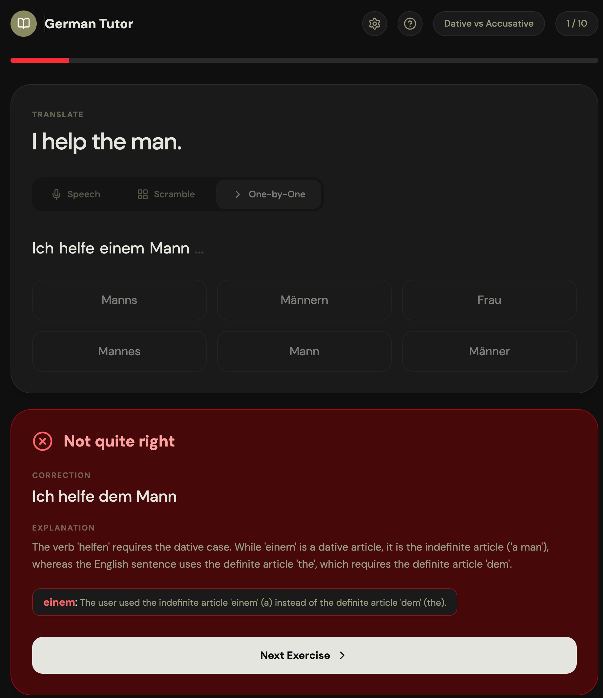

# German Tutor

AI-powered German grammar training app built with React, TypeScript, and the Gemini API.

[Live Demo](https://th3un1q3.github.io/german-training/) · [GitHub](https://github.com/Th3Un1q3/german-training)



</div>

## Features

- **Grammar rule review** — AI-generated cheat sheets with examples before each session
- **Three practice modes** — Speech (hold-to-speak), Scramble (reorder words), One-by-One (pick words step-by-step)
- **AI validation** — Gemini evaluates your answers with corrections and explanations
- **Configurable** — Choose your model, set a custom API base URL (OpenAI-compatible), adjust session length
- **Dark theme** — Minimal, distraction-free UI

## Run Locally

The project includes a [devcontainer](https://containers.dev/) configuration — open it in **GitHub Codespaces** or **VS Code Dev Containers** and dependencies are installed automatically.

1. Start the dev server:
   ```sh
   npm run dev
   ```
2. Open the app and add your **Gemini API key** in Settings (gear icon).
   You can get a free key at [aistudio.google.com/api-keys](https://aistudio.google.com/api-keys).

## Scripts

| Command | Description |
|---------|-------------|
| `npm run dev` | Start Vite dev server on port 3000 |
| `npm run build` | Production build to `dist/` |
| `npm run preview` | Preview the production build |
| `npm run lint` | Type-check with `tsc --noEmit` |

## Project Structure

```
src/
  App.tsx                    — Session orchestrator
  types.ts                   — Shared TypeScript interfaces
  lib/
    gemini.ts                — Gemini API calls (generate, validate, transcribe)
    utils.ts                 — cn() utility
  hooks/
    useRecentTopics.ts       — Recent topics localStorage hook
  components/
    StartScreen.tsx          — Topic selection & config
    RuleReview.tsx           — Grammar cheat sheet
    ExerciseView.tsx         — Exercise card with mode switcher
    SessionComplete.tsx      — Score summary
    SettingsModal.tsx        — API key / model / base URL
    Feedback.tsx             — Validation result
    HelpPanel.tsx            — Expandable grammar reference
    modes/
      SpeechMode.tsx
      ScrambleMode.tsx
      OneByOneMode.tsx
```

## Tech Stack

React 19 · TypeScript · Vite · Tailwind CSS v4 · [Gemini API](https://ai.google.dev/) (`@google/genai`) · Motion · Lucide Icons
